# TronikSlate → Wan2GP Plugin Conversion: Feasibility Analysis

## TL;DR

**Converting _all_ of TronikSlate into a single wan2gp plugin is not feasible.** However, individual feature tabs _can_ be extracted as separate plugins — and the Smooth Brain wizard already exists as one. The feature loss you experienced came from specific architectural mismatches, not from fundamental plugin limitations.

---

## What TronikSlate Actually Contains

TronikSlate is a **full-stack web application** (React + Vite + TypeScript frontend, Node.js backend) with **12 major UI component groups** and **15 server routes**:

| Component Group | What It Does |
|---|---|
| **SmoothBrain** | 4-step wizard (story → characters → storyboard → export) |
| **Storyboard** | Visual shot layout & beat editing |
| **ShotEditor** | Per-shot prompt, seed, ref-image editing |
| **Timeline** | Video timeline with drag/reorder |
| **AudioCropper** | Audio clip trimming |
| **VideoImport** | Import external video clips |
| **ImageManager** | Image gallery/management |
| **Export** | Final film export & assembly |
| **PromptAssistant** | AI prompt refinement |
| **Loras** (server route) | LoRA model management |
| **NLE** (server route) | Non-linear editing export |
| **Watcher** (server route) | File system watcher for hot updates |

## What a Wan2GP Plugin Can Do

The `WAN2GPPlugin` base class provides:

- **Gradio tab(s)** — Each plugin gets one or more tabs in the wan2gp UI
- **Component access** — Request wan2gp components (state, resolution, main_tabs, etc.)
- **Global function access** — e.g. `get_current_model_settings`, `process_tasks_cli`
- **GPU resource locking** — Acquire/release GPU for in-process rendering
- **Tab navigation** — `goto_video_tab` and `on_tab_select/deselect` hooks
- **Custom JS injection** — `add_custom_js` for client-side enhancements
- **Data hooks** — `register_data_hook` for cross-plugin communication
- **Component insertion** — `insert_after` to inject UI into the main form

> [!IMPORTANT]
> Plugins are **Gradio-only**. There is no way to embed a React/Vite app, run a separate Express server, or serve custom HTML outside of Gradio components within the plugin system.

---

## Why Full Conversion Is Not Feasible

| TronikSlate Feature | Plugin Blocker |
|---|---|
| **React/TypeScript UI** | Plugins must use Gradio. The entire frontend would need to be rewritten. |
| **Express server routes** (15 of them) | No way to run a separate HTTP server inside a plugin. |
| **Timeline/NLE** | Drag-and-drop timeline is not possible in Gradio's component set. |
| **AudioCropper** | Waveform-based audio trimming requires custom JS/Canvas beyond what Gradio supports. |
| **File system watcher** | Long-running background processes aren't supported by the plugin lifecycle. |
| **Video assembly/export** | FFmpeg-based video concatenation needs dedicated backend routes. |

---

## What CAN Be Converted to Plugins (Tab by Tab)

### ✅ Already Done: Smooth Brain Wizard
The existing `smooth-brain-wan2gp` plugin captures the 4-step wizard. The feature loss you saw is addressable.

### ✅ Feasible as Separate Plugins

| Feature | Plugin Complexity | Notes |
|---|---|---|
| **Prompt Assistant** | 🟢 Low | Text input + Ollama refinement. Perfect fit for a Gradio tab. |
| **Storyboard Viewer** | 🟡 Medium | Image gallery + text overlays. Gradio Gallery + HTML components work for a read-only or lightly-interactive version. Loses drag-and-drop reordering. |
| **Shot Editor** | 🟡 Medium | Per-shot prompt/seed editing. Works as a Gradio form. Loses the rich card-based UI. |
| **Image Manager** | 🟡 Medium | Gallery browsing + selection. Gradio Gallery handles this, but with less polish. |
| **LoRA Manager** | 🟡 Medium | Already exists as a separate wan2gp plugin (`wan2gp-lora-manager`). |

### ❌ Not Feasible as Plugins

| Feature | Why |
|---|---|
| **Timeline Editor** | Requires drag-and-drop, keyframes, playback — not possible in Gradio |
| **Audio Cropper** | Needs waveform rendering and interactive audio trimming |
| **Video Import/Assembly** | Needs FFmpeg backend pipeline + file management |
| **NLE Export** | Complex file format generation (EDL, XML) + backend processing |
| **File Watcher** | Long-running daemon process outside plugin lifecycle |

---

## Why Smooth Brain Lost Features (and How to Fix It)

The existing `smooth-brain-wan2gp` plugin is ~2000 lines vs TronikSlate root's ~2800 lines (plugin.py + mixins). Key differences:

1. **Ollama integration**: TronikSlate root `ollama.py` = 27KB vs plugin's `ollama.py` = 17KB. The root version has **more refined prompt packing, vision model support, and character description** features.

2. **Render engine**: TronikSlate root has `render_engine.py` (540 lines) as a dedicated mixin with advanced yield-state management, generator-based rendering with user-approval preservation. The plugin version inlines a simplified version.

3. **Speed profile auto-selection**: TronikSlate has sophisticated ranking (i2v preference → date → steps). The plugin has this but may not be fully synced.

4. **GPU-aware resolution**: `gpu_utils.py` is shared, but the root version uses it more aggressively for smart defaults.

5. **Project persistence**: Both have `state.py` but the root version has more robust resume/import features.

> [!TIP]
> The fix is to **sync the plugin back with the root codebase**, not to create a new plugin. The `smooth-brain-wan2gp` plugin has the same module structure — it just needs the latest code from each module.

---

## Recommended Strategy

```mermaid
graph TD
    A[TronikSlate Full App] --> B[Standalone Web App<br/>All features, own UI]
    A --> C[Wan2GP Plugins<br/>Subset of features]
    C --> D[🧠 Smooth Brain Plugin<br/>Already exists, needs sync]
    C --> E[📝 Prompt Assistant Plugin<br/>New - easy to extract]
    C --> F[🎬 Storyboard Viewer Plugin<br/>New - medium effort]
    C --> G[🖼️ Shot Editor Plugin<br/>New - medium effort]
    
    style B fill:#2d5a3d,stroke:#4ade80
    style D fill:#3b3d5a,stroke:#818cf8
    style E fill:#3b3d5a,stroke:#818cf8
    style F fill:#3b3d5a,stroke:#818cf8
    style G fill:#3b3d5a,stroke:#818cf8
```

1. **Keep TronikSlate as the full-featured standalone app** — it's the source of truth
2. **Sync the Smooth Brain plugin** — bring `ollama.py`, `render_engine.py`, and `state.py` up to parity with root
3. **Extract individual features as new plugins** — Prompt Assistant, Storyboard Viewer, Shot Editor
4. **Don't try to replicate Timeline/Audio/NLE** in Gradio — these need the full web app

Would you like me to start syncing the Smooth Brain plugin with the latest root code, or would you prefer to create one of the new feature plugins first?
